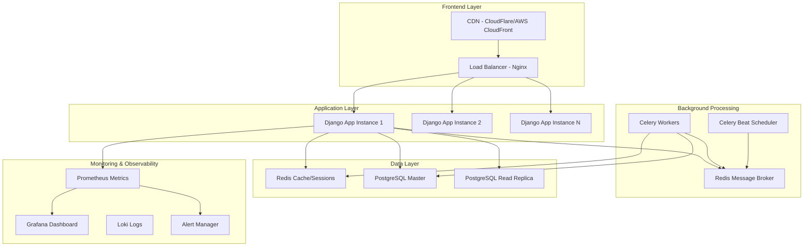

# Design Document - DevBlog Optimization

## Overview

Este diseño transforma DevBlog en una plataforma de blogging de nivel empresarial mediante la implementación de arquitectura escalable, sistemas de monitoreo avanzados, optimizaciones de rendimiento y medidas de seguridad robustas. La solución utiliza tecnologías modernas como Redis, Celery, Prometheus, y CDN para crear una experiencia de usuario superior y capacidades operacionales avanzadas.

## Architecture

### High-Level Architecture



### Technology Stack Enhancement

**Current Stack:**
- Django 5.2.4
- PostgreSQL
- Docker
- Tailwind CSS

**Enhanced Stack:**
- **Caching:** Redis 7.x
- **Background Tasks:** Celery + Redis
- **Monitoring:** Prometheus + Grafana + Loki
- **CDN:** CloudFlare or AWS CloudFront
- **Load Balancer:** Nginx with health checks
- **Security:** django-ratelimit, django-axes
- **Testing:** pytest, coverage, locust
- **Code Quality:** ruff, black, pre-commit

## Components and Interfaces

### 1. Caching Layer

**Redis Configuration:**
```python
# Cache backends
CACHES = {
    'default': {
        'BACKEND': 'django_redis.cache.RedisCache',
        'LOCATION': 'redis://redis:6379/1',
        'OPTIONS': {
            'CLIENT_CLASS': 'django_redis.client.DefaultClient',
            'SERIALIZER': 'django_redis.serializers.json.JSONSerializer',
            'COMPRESSOR': 'django_redis.compressors.zlib.ZlibCompressor',
        }
    },
    'sessions': {
        'BACKEND': 'django_redis.cache.RedisCache',
        'LOCATION': 'redis://redis:6379/2',
    }
}

# Session configuration
SESSION_ENGINE = 'django.contrib.sessions.backends.cache'
SESSION_CACHE_ALIAS = 'sessions'
```

**Cache Strategy:**
- **Posts:** Cache individual posts for 1 hour, lists for 15 minutes
- **User Profiles:** Cache for 30 minutes
- **Tags:** Cache popular tags for 2 hours
- **Comments:** Cache comment counts for 10 minutes
- **Templates:** Cache rendered templates for 1 hour

### 2. Database Optimization

**Query Optimization Patterns:**
```python
# Optimized querysets
class OptimizedPostManager(models.Manager):
    def published_with_relations(self):
        return self.select_related(
            'author', 'author__profile'
        ).prefetch_related(
            'tags', 'comments__author', 'likes'
        ).filter(status='published')
    
    def with_stats(self):
        return self.annotate(
            likes_count=Count('likes'),
            comments_count=Count('comments'),
            views_count=F('views')
        )
```

**Database Indexes:**
```python
class Meta:
    indexes = [
        models.Index(fields=['status', '-created_at']),
        models.Index(fields=['author', 'status']),
        models.Index(fields=['slug']),
        models.Index(fields=['-views']),
        models.Index(fields=['is_sticky', '-created_at']),
    ]
```

### 3. Rate Limiting and Security

**Rate Limiting Configuration:**
```python
# Rate limiting decorators
@ratelimit(key='ip', rate='100/m', method='ALL')
@ratelimit(key='user', rate='1000/h', method='ALL')
def api_endpoint(request):
    pass

# Security middleware stack
MIDDLEWARE = [
    'django.middleware.security.SecurityMiddleware',
    'django_ratelimit.middleware.RatelimitMiddleware',
    'axes.middleware.AxesMiddleware',
    'blog.middleware.SecurityHeadersMiddleware',
    # ... existing middleware
]
```

**File Upload Security:**
```python
class SecureFileUploadMixin:
    def validate_file(self, file):
        # Validate file type, size, and content
        # Scan for malware
        # Generate secure filename
        # Resize and optimize images
        pass
```

### 4. Background Tasks Architecture

**Celery Configuration:**
```python
# Celery settings
CELERY_BROKER_URL = 'redis://redis:6379/0'
CELERY_RESULT_BACKEND = 'redis://redis:6379/0'
CELERY_TASK_SERIALIZER = 'json'
CELERY_ACCEPT_CONTENT = ['json']
CELERY_RESULT_SERIALIZER = 'json'
CELERY_TIMEZONE = 'UTC'

# Task routing
CELERY_TASK_ROUTES = {
    'posts.tasks.generate_ai_content': {'queue': 'ai_processing'},
    'accounts.tasks.send_notifications': {'queue': 'notifications'},
    'posts.tasks.optimize_images': {'queue': 'media_processing'},
}
```

**Task Categories:**
- **AI Processing:** Content generation, tag extraction
- **Media Processing:** Image optimization, thumbnail generation
- **Notifications:** Email sending, push notifications
- **Analytics:** Report generation, data aggregation
- **Maintenance:** Cache warming, cleanup tasks

### 5. Monitoring and Observability

**Metrics Collection:**
```python
# Custom metrics
from prometheus_client import Counter, Histogram, Gauge

REQUEST_COUNT = Counter('django_requests_total', 'Total requests', ['method', 'endpoint'])
REQUEST_LATENCY = Histogram('django_request_duration_seconds', 'Request latency')
ACTIVE_USERS = Gauge('django_active_users', 'Active users')
```

**Health Check Endpoints:**
```python
# Health check views
def health_check(request):
    checks = {
        'database': check_database(),
        'redis': check_redis(),
        'celery': check_celery(),
        'disk_space': check_disk_space(),
    }
    return JsonResponse(checks)
```

**Structured Logging:**
```python
LOGGING = {
    'formatters': {
        'json': {
            'class': 'pythonjsonlogger.jsonlogger.JsonFormatter',
            'format': '%(asctime)s %(name)s %(levelname)s %(message)s'
        }
    },
    'handlers': {
        'json_file': {
            'class': 'logging.handlers.RotatingFileHandler',
            'filename': '/app/logs/app.json',
            'formatter': 'json',
        }
    }
}
```

## Data Models

### Enhanced Models

**Post Model Enhancements:**
```python
class Post(models.Model):
    # ... existing fields ...
    
    # Performance fields
    cached_likes_count = models.PositiveIntegerField(default=0)
    cached_comments_count = models.PositiveIntegerField(default=0)
    last_activity = models.DateTimeField(auto_now=True)
    
    # SEO fields
    meta_description = models.TextField(max_length=160, blank=True)
    meta_keywords = models.CharField(max_length=255, blank=True)
    
    # Analytics fields
    bounce_rate = models.FloatField(default=0.0)
    avg_time_on_page = models.DurationField(null=True, blank=True)
    
    class Meta:
        indexes = [
            models.Index(fields=['status', '-created_at']),
            models.Index(fields=['author', 'status']),
            models.Index(fields=['-cached_likes_count']),
            models.Index(fields=['-views']),
        ]
```

**Analytics Models:**
```python
class PageView(models.Model):
    post = models.ForeignKey(Post, on_delete=models.CASCADE)
    user = models.ForeignKey(User, null=True, on_delete=models.SET_NULL)
    ip_address = models.GenericIPAddressField()
    user_agent = models.TextField()
    referrer = models.URLField(blank=True)
    timestamp = models.DateTimeField(auto_now_add=True)
    session_id = models.CharField(max_length=40)
    time_on_page = models.DurationField(null=True)

class UserEvent(models.Model):
    EVENT_TYPES = [
        ('page_view', 'Page View'),
        ('like', 'Like'),
        ('comment', 'Comment'),
        ('share', 'Share'),
        ('search', 'Search'),
    ]
    
    user = models.ForeignKey(User, null=True, on_delete=models.SET_NULL)
    event_type = models.CharField(max_length=20, choices=EVENT_TYPES)
    object_id = models.PositiveIntegerField(null=True)
    metadata = models.JSONField(default=dict)
    timestamp = models.DateTimeField(auto_now_add=True)
```

## Error Handling

### Comprehensive Error Handling Strategy

**Error Categories:**
1. **Application Errors:** Business logic failures
2. **Infrastructure Errors:** Database, Redis, external services
3. **Security Errors:** Rate limiting, authentication failures
4. **Performance Errors:** Slow queries, timeouts

**Error Handling Implementation:**
```python
class ErrorHandlingMiddleware:
    def process_exception(self, request, exception):
        # Log error with context
        logger.error(
            "Unhandled exception",
            extra={
                'exception_type': type(exception).__name__,
                'user_id': getattr(request.user, 'id', None),
                'path': request.path,
                'method': request.method,
                'ip': get_client_ip(request),
            },
            exc_info=True
        )
        
        # Send to monitoring system
        if hasattr(settings, 'SENTRY_DSN'):
            capture_exception(exception)
        
        # Return appropriate response
        if request.headers.get('Accept') == 'application/json':
            return JsonResponse({
                'error': 'Internal server error',
                'code': 'INTERNAL_ERROR'
            }, status=500)
        
        return render(request, '500.html', status=500)
```

**Circuit Breaker Pattern:**
```python
class CircuitBreaker:
    def __init__(self, failure_threshold=5, timeout=60):
        self.failure_threshold = failure_threshold
        self.timeout = timeout
        self.failure_count = 0
        self.last_failure_time = None
        self.state = 'CLOSED'  # CLOSED, OPEN, HALF_OPEN
    
    def call(self, func, *args, **kwargs):
        if self.state == 'OPEN':
            if time.time() - self.last_failure_time > self.timeout:
                self.state = 'HALF_OPEN'
            else:
                raise CircuitBreakerOpenException()
        
        try:
            result = func(*args, **kwargs)
            self.on_success()
            return result
        except Exception as e:
            self.on_failure()
            raise e
```

## Testing Strategy

### Comprehensive Testing Approach

**Test Categories:**
1. **Unit Tests:** Individual components and functions
2. **Integration Tests:** Component interactions
3. **Performance Tests:** Load and stress testing
4. **Security Tests:** Vulnerability scanning
5. **E2E Tests:** Full user workflows

**Testing Tools and Configuration:**
```python
# pytest configuration
[tool.pytest.ini_options]
DJANGO_SETTINGS_MODULE = "blog.configuraciones.test_settings"
python_files = ["tests.py", "test_*.py", "*_tests.py"]
addopts = [
    "--cov=.",
    "--cov-report=html",
    "--cov-report=term-missing",
    "--cov-fail-under=95",
    "--reuse-db",
    "--nomigrations",
]

# Performance testing with locust
class UserBehavior(HttpUser):
    wait_time = between(1, 3)
    
    def on_start(self):
        self.login()
    
    @task(3)
    def view_posts(self):
        self.client.get("/")
    
    @task(1)
    def view_post_detail(self):
        self.client.get(f"/post/{random.choice(self.post_slugs)}/")
```

**Security Testing:**
```python
# Security test cases
class SecurityTestCase(TestCase):
    def test_rate_limiting(self):
        # Test rate limiting enforcement
        pass
    
    def test_sql_injection_protection(self):
        # Test SQL injection attempts
        pass
    
    def test_xss_protection(self):
        # Test XSS prevention
        pass
    
    def test_file_upload_security(self):
        # Test malicious file upload prevention
        pass
```

## Performance Optimization

### Multi-Level Optimization Strategy

**Database Level:**
- Connection pooling with pgbouncer
- Read replicas for read-heavy operations
- Proper indexing strategy
- Query optimization and monitoring

**Application Level:**
- Redis caching at multiple layers
- Database query optimization
- Async processing with Celery
- Template caching

**Infrastructure Level:**
- CDN for static assets
- Load balancing
- Horizontal scaling
- Container optimization

**Frontend Level:**
- Asset minification and compression
- Lazy loading for images
- Progressive web app features
- Service worker caching

## Security Implementation

### Defense in Depth Strategy

**Network Security:**
- WAF (Web Application Firewall)
- DDoS protection
- SSL/TLS encryption
- VPN for admin access

**Application Security:**
- Input validation and sanitization
- CSRF and XSS protection
- SQL injection prevention
- Secure file uploads

**Authentication & Authorization:**
- Multi-factor authentication
- Role-based access control
- Session management
- Password policies

**Data Security:**
- Encryption at rest
- Encryption in transit
- Data anonymization
- Backup encryption

## Deployment Architecture

### Production Deployment Strategy

**Container Orchestration:**
```yaml
# docker-compose.prod.yml
version: '3.8'
services:
  nginx:
    image: nginx:alpine
    ports:
      - "80:80"
      - "443:443"
    volumes:
      - ./nginx.conf:/etc/nginx/nginx.conf
      - ./ssl:/etc/ssl
  
  web:
    build: .
    deploy:
      replicas: 3
      resources:
        limits:
          memory: 512M
        reservations:
          memory: 256M
  
  celery:
    build: .
    command: celery -A blog worker -l info
    deploy:
      replicas: 2
  
  redis:
    image: redis:7-alpine
    command: redis-server --appendonly yes
    volumes:
      - redis_data:/data
  
  postgres:
    image: postgres:14
    environment:
      POSTGRES_DB: devblog_prod
    volumes:
      - postgres_data:/var/lib/postgresql/data
```

**CI/CD Pipeline:**
```yaml
# .github/workflows/deploy.yml
name: Deploy to Production
on:
  push:
    branches: [main]

jobs:
  test:
    runs-on: ubuntu-latest
    steps:
      - uses: actions/checkout@v3
      - name: Run tests
        run: |
          python -m pytest
          python -m coverage report --fail-under=95
  
  security:
    runs-on: ubuntu-latest
    steps:
      - name: Security scan
        run: |
          bandit -r .
          safety check
  
  deploy:
    needs: [test, security]
    runs-on: ubuntu-latest
    steps:
      - name: Deploy to production
        run: |
          docker-compose -f docker-compose.prod.yml up -d
```

Este diseño proporciona una base sólida para transformar DevBlog en una plataforma de nivel empresarial con todas las características modernas necesarias para escalabilidad, seguridad y observabilidad.